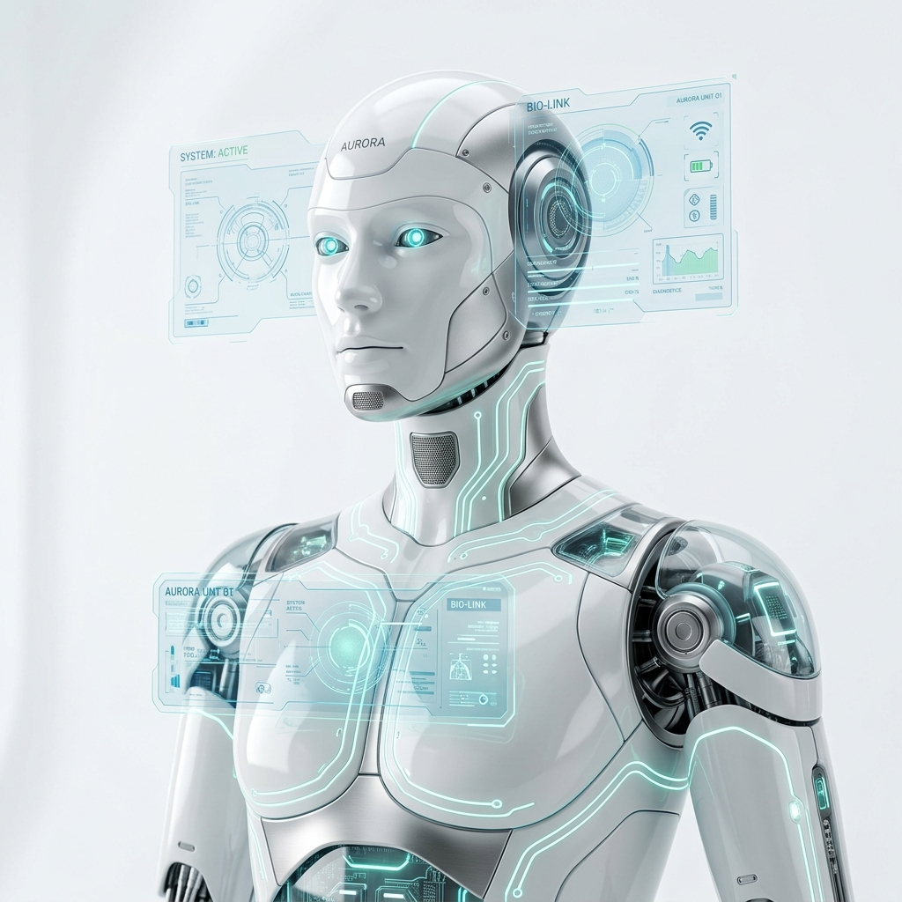

# CYBORG ONE — The Future of Human Intelligence



> **"The Future Begins With Artificial Intelligence"**  
> An award-winning, production-quality AI & Robotics landing page.

---

## Overview

CYBORG ONE is a world-class, fully responsive landing page built with a futuristic, clean, and premium aesthetic. Inspired by Apple Vision Pro, Tesla Optimus, OpenAI, BMW i Vision, and NASA — it combines glassmorphism, advanced animations, and interactive elements to deliver an Awwwards-caliber user experience.

---

## Project Structure

```
CYBORG ONE/
├── index.html          # Main HTML — complete semantic structure
├── style.css           # Premium CSS — glassmorphism, animations, responsive
├── script.js           # JavaScript — GSAP, Three.js, interactions
├── assets/
│   ├── images/
│   │   └── hero-robot.png    # AI-generated hero robot image
│   ├── icons/                # SVG icon files (inline in HTML)
│   └── fonts/                # Custom font references
└── README.md
```

---

## Features

### 🎨 Design
- **Glassmorphism** throughout — cards, navbar, forms
- **Premium color palette** — Teal, Cyan, Mint, Champagne Gold on pure white
- **Modern typography** — Space Grotesk + Inter + Manrope (Google Fonts)
- **Bright futuristic aesthetic** — No dark backgrounds, no neon cyberpunk

### ✨ Animations & Interactions
- **Loading screen** with animated progress ring and particle canvas
- **Custom cursor glow** with interactive scaling
- **GSAP ScrollTrigger** — fade, slide, scale, rotate, parallax
- **Three.js hero canvas** — animated particle neural network
- **Mouse parallax** on robot, orbs, and floating cards
- **3D tilt effect** on product and feature cards
- **Animated counters** on statistics
- **Auto-sliding testimonials** with swipe support
- **FAQ accordion** with smooth transitions
- **Ripple effects** on buttons
- **Robot float animation** with glow ring

### 📱 Responsive
- Desktop → Tablet → Mobile fully adapted
- Hamburger menu for mobile
- Grid layouts adapt from 4-col to 1-col

### ♿ Accessibility
- Semantic HTML5 structure
- ARIA labels and roles throughout
- Keyboard navigation support
- Focus-visible styles
- Reduced-motion support

### 🔍 SEO
- Full meta tags, Open Graph, Twitter Card
- Structured data (JSON-LD)
- Semantic heading hierarchy
- Optimized alt text

---

## Sections

| Section | Description |
|---------|-------------|
| **Loader** | Animated progress ring with particle canvas |
| **Navbar** | Floating glass navbar, sticky, mobile hamburger |
| **Hero** | Fullscreen with robot, Three.js network, floating cards |
| **Features** | 8 glass cards with icon, title, description |
| **Statistics** | Animated counters — 250+ projects, 150K+ users |
| **Innovation** | 8 technology cards with gradient icons |
| **Products** | 6 product showcase cards with 3D hover |
| **Timeline** | 6-stage process with alternating layout |
| **Testimonials** | Auto-sliding with swipe, 5 testimonials |
| **FAQ** | Animated accordion with 5 questions |
| **Contact** | Glass form with validation feedback |
| **Footer** | Dark minimal, social links, newsletter |

---

## Tech Stack

| Technology | Version | Purpose |
|------------|---------|---------|
| HTML5 | Latest | Structure & Semantics |
| CSS3 | Latest | Styling & Animations |
| JavaScript (ES6+) | Latest | Interactivity & Logic |
| GSAP | 3.12.5 | Scroll + Timeline Animations |
| ScrollTrigger | 3.12.5 | Scroll-driven Animations |
| Three.js | r128 | 3D Particle Neural Network |
| AOS | 2.3.1 | Scroll-reveal Animations |
| Inter | Google Fonts | Body Typography |
| Space Grotesk | Google Fonts | Display Typography |
| Manrope | Google Fonts | Accent Typography |

---

## How to Run

Simply open `index.html` in any modern browser. No build step required.

```bash
# If using VS Code + Live Server:
# Right-click index.html → Open with Live Server

# Or via Python:
python -m http.server 8000
# Then open http://localhost:8000
```

---

## Browser Support

- Chrome 90+
- Firefox 88+
- Safari 14+
- Edge 90+

---

## Design Inspiration

- **Apple Vision Pro** — Clean spatial interface
- **Tesla Optimus** — Humanoid robotics aesthetic
- **OpenAI** — Minimal, intelligent, text-forward
- **BMW i Vision** — Premium automotive futurism
- **Google DeepMind** — Scientific, trustworthy
- **NASA** — Precision, data, exploration

---

## Color Palette

| Name | Hex | Usage |
|------|-----|-------|
| Pure White | `#FFFFFF` | Background |
| Off White | `#F8F9FA` | Section backgrounds |
| Accent Teal | `#0d9488` | Primary accent |
| Accent Cyan | `#06b6d4` | Secondary accent |
| Accent Mint | `#10b981` | Tertiary accent |
| Emerald | `#34d399` | Highlight |
| Dark Charcoal | `#222222` | Primary text |
| Medium Gray | `#555555` | Secondary text |

---

*CYBORG ONE © 2025 · The Future of Human Intelligence*
